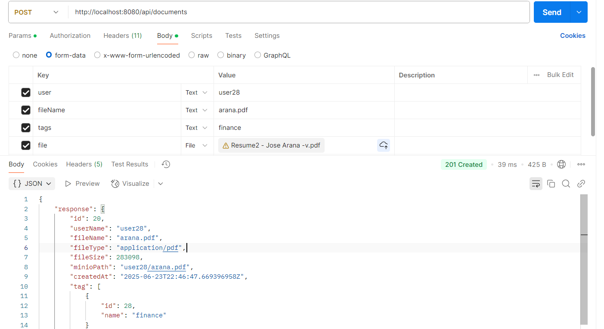
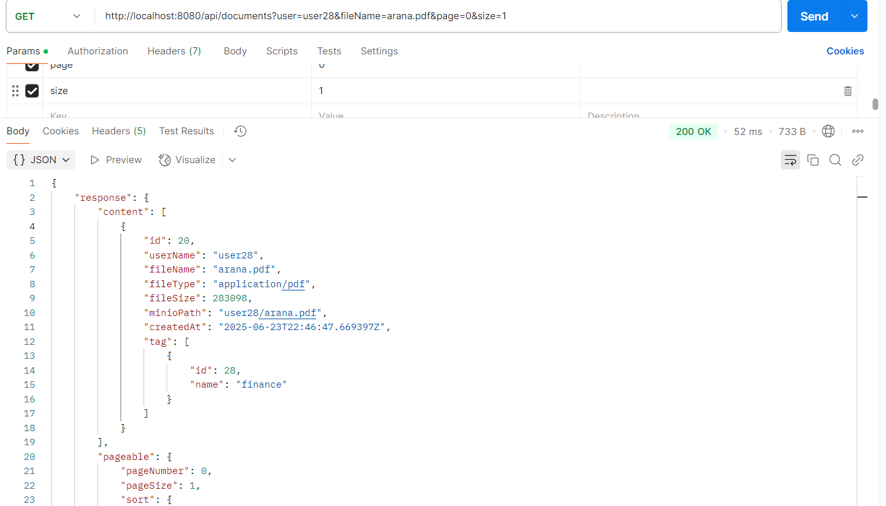
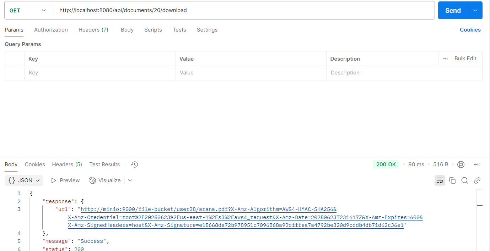
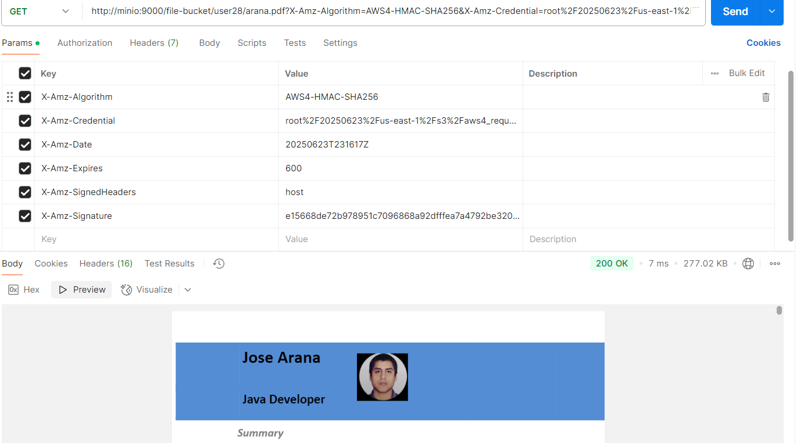

# Project File Service

A Spring Boot-based RESTful service for uploading, searching and downloading PDF documents with metadata tagging.

The purpose of these file is to instruct on how to have the file-service up and running as per the challenge requirement

---

## Features 

- Upload PDF files (up to 500MB)
- Store files in MinIO using path: `file-bucket/{user}/{file}`
- Save file metadata in PostgreSQL (user, file name, tags, etc.)
- Reusable tags (normalized many-to-many relationship)
- Full-text + tag-based search with pagination using 
- Generate pre-signed download URLs
- Concurrent uploads (up to 10x and 500MB in total) with memory usage < 50MB
- Clean code with DTOs, wrapping responses, and exception handling, also externalized configurations via Environment variables
---

##  Tech Stack

- Java 17 (Java 8 language features)
- Spring Boot 3
- Spring Web / Spring Data JPA
- PostgreSQL
- MinIO (S3-compatible)
- Swagger (OpenAPI)
- JUnit 5 + Mockito + AssertJ
- Jacoco (test coverage)
- Spotless (code formatting)
---

#### Prerequisites:
- Java 17, with Java 8 language-level support
- Docker + Docker Compose
- Reuse or provide your own Environment variables by using the .env file provided in the docker directory

#### Steps 

### 1. Clone the repo:
git clone https://github.com/josecan2604/arana-service.git

### 2. Run the following command:
    cd docker  
    docker-compose up 
        #### This will look for the dcker-compose file, file that contains all necesary configurations to init the services, and init  file-service, postgres and s3  as a stack picking the values in the .env file

### 3. Test the endpoints

|      | Endpoint                       |                      |
|------| ------------------------------ | ------------------------------- |
| POST | `/api/documents`               | Upload PDF file                 |
| GET  | `/api/documents`               | Search files                    |
| GET  | `/api/documents/{id}/download` | Get pre-signed URL for download |

A.- POST  `/api/documents`     | Upload PDF file  
Supports concurrency, upload up to 10 files at once, I used ExecutorService for is feature

B.= | GET  | `/api/documents`    | Search files                    
Supports flexible queries, sorting, filtering, and pagination

C.- | GET  | `/api/documents/{id}/download` | Get pre-signed URL for download 

Supports secure access to pre-signed url using AWS s3 features

Right after that, you'll receive an url, use it in a separate request to see the uploaded file

Also, take into account to conf your ens to associate the minio service name to localhost, so your request can resolve the name

Thanks